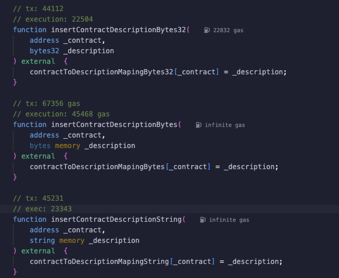

## Approach

### Data type for storing descriptions

The best data type would be mapping since it allows key-value storage. It allows quick lookup of data using a unique identifier.

### Determining best data type for mapping

To decide which data type will be most gas-efficient, I will consider different data types including `bytes`, `bytes32`, and `string`.

Since I don't know if the string data stored in the mapping will have a fixed size, I will only focus on `bytes` and `string`. We can clearly see that `string` performs much better than `bytes`, so I will use this data type in the contract.

### Access Control

I will rely on implementation from OpenZeppelin since it works out-of-the-box, is well-tested, and allows setting different roles for our smart contract like `ADD_ROLE`, `UPDATE_ROLE`, and `REMOVE_ROLE` to handle different levels of privileges.

## Functions

### `addContractDescription(address contract, string memory description)`

#### Purpose:

Adds a new description for a contract.

#### Access Control:

Requires **ADD_ROLE**

#### Parameters:

- contract: The address of the contract to describe.
- description: The description of the contract.

#### Implementation Notes:

Inserts the new contract description into the mapping. Does not perform existence checks, assuming new entries are always valid.

### `updateContractDescription(address contract, string memory description)`

#### Purpose:

Updates the description of a specified contract.

#### Access Control:

Requires **UPDATE_ROLE**

#### Parameters:

- contract: The address of the contract to be updated.
- description: The new description for the contract.

#### Reverts:

- ContractNotExist: If the contract address does not exist in the mapping.
- StaleDescription: If the new description matches the current one.
- CannotSetToEmpty: If the new description is an empty string.

#### Implementation Notes:

This function checks for the existence of the contract, ensures the description is not stale or empty, and updates the description if all checks pass.

### `removeContractDescription(address contract)`

#### Purpose:

Removes the description of a specified contract.

#### Access Control:

Requires **REMOVE_ROLE**

#### Parameters:

- contract: The address of the contract whose description is to be removed.

#### Implementation Notes:

Deletes the entry for the specified contract from the mapping. Does not revert if the contract does not exist, silently failing instead.

## Testing Approach

### Unit Tests

1. Add Contract Description:

   - Test adding a contract description with **ADD_ROLE**.
   - Verify that attempting to add a description without **ADD_ROLE** reverts.

2. Update Contract Description:

   - Test updating an existing contract's description with **UPDATE_ROLE**.
   - Verify that updating to the same description reverts with StaleDescription.
   - Verify that updating a non-existent contract reverts with ContractNotExist.
   - Verify that updating to an empty description reverts with CannotSetToEmpty.

3. Remove Contract Description:

   - Test removing a contract's description with **REMOVE_ROLE**.
   - Verify that removing a description for a non-existent contract does not revert but has no effect.

# ContractManager Test Suite

## Overview

This test suite is designed to verify the functionality of the `ContractManager` contract using the Foundry test framework.

## Test Cases

### Setup

- **Function**: `setUp()`
- **Description**: Initializes the `ContractManager` and assigns roles to test users.

### Test: Add Contract Description

- **Function**: `test_addContractDescription()`
- **Description**: Confirms that a user with `ADD_ROLE` can successfully add a contract description.
- **Expectation**: The contract description is added, and its retrieval is confirmed.

### Test: Update Contract Description

- **Function**: `test_updateContractDescription()`
- **Description**: Ensures that a user with `UPDATE_ROLE` can update a contract's description.
- **Dependencies**: `test_addContractDescription`
- **Expectation**: The contract description is updated, and the change is verified.

### Test: Remove Contract Description

- **Function**: `test_removeContractDescription()`
- **Description**: Verifies that a user with `REMOVE_ROLE` can remove a contract's description.
- **Dependencies**: `test_addContractDescription`
- **Expectation**: The contract description is removed, and its absence is confirmed.

### Test: Non-Privileged Add, Update, Remove

- **Function**: `test_revert_interactContractDescriptionNonPrivileged()`
- **Description**: Tests that non-privileged users cannot interact with contract descriptions.
- **Expectation**: Transactions from non-privileged users are reverted as expected.

### Test: Update Non-Existent Contract

- **Function**: `test_revert_updateNonExistantContract()`
- **Description**: Checks that updating a non-existent contract's description is not allowed.
- **Dependencies**: `test_addContractDescription`
- **Expectation**: The transaction is reverted with `ContractNotExist` error selector.

### Test: Update with Empty Description

- **Function**: `test_revert_updateContractDescriptionWithEmptyDescription()`
- **Description**: Ensures updating a contract's description to an empty string is not permitted.
- **Dependencies**: `test_addContractDescription`
- **Expectation**: The transaction is reverted with `CannotSetToEmpty` error selector.

### Test: Update with Stale Description

- **Function**: `test_revert_updateContractDescriptionWithStaleDescription()`
- **Description**: Confirms that updating a contract's description to the current description is not allowed.
- **Dependencies**: `test_addContractDescription`
- **Expectation**: The transaction is reverted with `StaleDescription` error selector.
