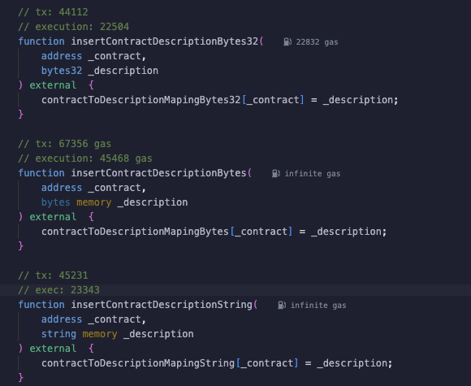
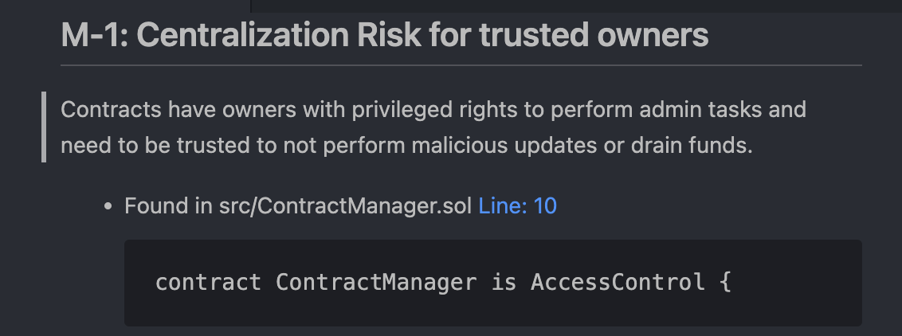
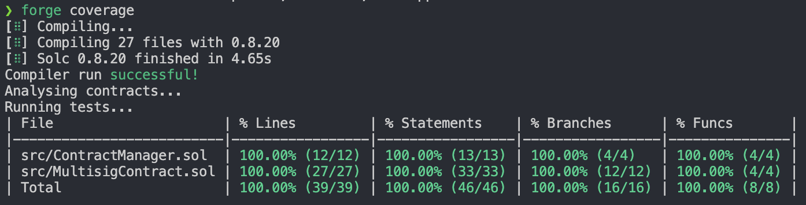

# Approach

### Data type for storing descriptions

The best data type would be mapping since it allows key-value storage. It allows quick lookup of data using a unique identifier - address in this case.

### Determining best data type for mapping

To decide which data type will be most gas-efficient, I will consider different data types including `bytes`, `bytes32`, and `string`.

Since I don't know if the string data stored in the mapping will have a fixed size, I will only focus on `bytes` and `string`. We can clearly see that `string` performs much better than `bytes`, so I will use this data type in the contract.

### Access Control

Initially I was thinking about using **OpenZeppelin** implementation, but Aderyn scan pointed out centralization issue, so I dicided to migrate to MultiSig where each action must reach threshold consensus to be executed on ContractManager.

# Contracts

The contracts will be split in 2:

- **ContractManager** - managing description actions
- **MultisigContract** - approving and executing actions on ContractManager

### ContractManager

All actions are restricted to owner which is the `MulitsigContract`.

Contract will have following functions for managing contracts descriptions:

- add
- update
- remove

### MultisigContract

To simplify deployment MulitsigContract will deploy ContractManager to set itself as owner.

Privileged owners that will be set in constructor will have permission to propose and approve actions that will be executed on `ContractManager`

## Testing Approach

The tests will be split into 4 categories:

- unit
- integration
- fuzz (stateless)
- invariant (statefull)

### Unit Tests

#### ContractManager

Initialization and Ownership

- test that the owner is correctly initialized
- ensure only the owner can perform administrative actions
- ensure that owner cannot be set to null address

Contract Description Management

- test adding new contract descriptions
- ensure updating contract descriptions
- test removing contract descriptions
- ensure operations are performed by the owner only
- verify that descriptions cannot be updated with the same description
- verify that descriptions cannot be set to empty strings
- verify that descriptions can only be updated for existing contracts

#### MultisigContract

Initialization and Ownership

- test that owners are correctly initialized
- ensure that none of the owners is not null address

Action Proposal

- verify that only onwers can propose actions
- verify that action cannot be proposed twice
- verify that proposed action has matching selector of actions from ContractManager

Action Approval

- verify that proposer cannot approve his action (avoid double counting)
- verify that action cannot be approved twice by the same owner
- verify that non-existing action cannot be approved

Action Execution

- verify that valid actions after reaching threshold are executed
- verify that action is removed from pending actions after execution

### Integration Test

Test interactions between the MultisigContract and ContractManager:

- verify that after action approval reach threshold they get executed and modify ContractManager state
- verify that if action execution fails it get cought in MultisigContract
- ensure contract descriptions are updated correctly in ContractManager after actions are executed in MultisigContract

### Fuzz Tests

- ensure ContractManager functions execute correctly
- enusre `MultisigContract::approveAction()` works correctly

### Invariant Tests

- ensure that pending proposed action must be one of ContractManager function
- ensure that pending proposed action does not have empty execution data

### Coverage

Comprahenive test suite covers 100% code.

## Security Analysis

Smart contracts where analysed using:

- Slither - didn't not find any issues, but it pointed out that some vars should be immutalbe so I have made appropriate corrections

- Aderyn - has once again centralization of ownership, but it's has been fixed through Multisig, but apparently Aderyn is lacking context on this.
- Myth - didn't found any issues.

## Solidity Metrics

Solidity Metrics report has been generated that provides some more detiled overview about the contracts. Including statistics and callgraphs. The report is available [here](/doc/analytics/solidity-metrics.html) and can be viewed by previewing it or opening in web browser.
